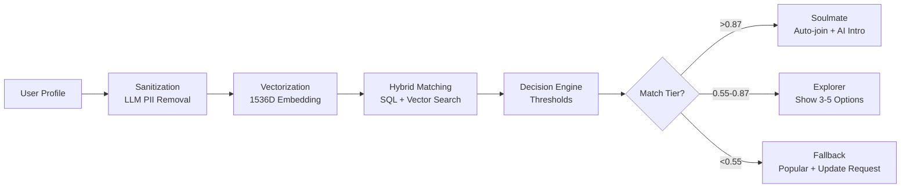
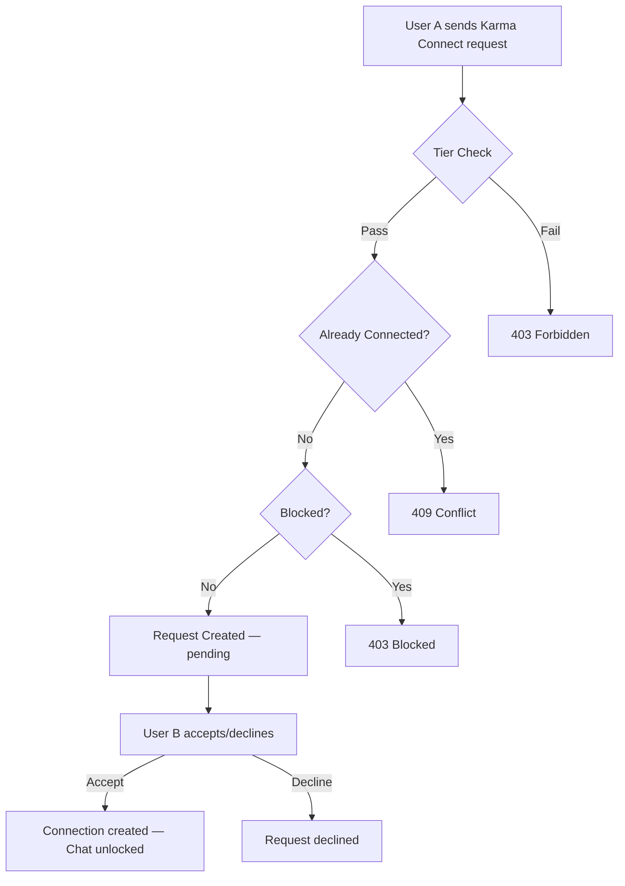

# AI-Powered Community Matching System v2.0

Intelligent onboarding solution with **<2 second** community matching using hybrid algorithms, a **reputation-based karma system**, **real-time WebSocket** delivery, and a full **social networking layer** (connections, discovery, events, chat).

## Architecture

### Tech Stack
- **API**: Python FastAPI (async, Pydantic validation)
- **Task Queue**: Celery + Redis broker
- **Database**: PostgreSQL 16 (user data) + Pinecone (vectors)
- **AI/ML**: OpenAI GPT-4o-mini + text-embedding-3-small
- **Real-time**: WebSocket (Socket.io) + Redis Pub/Sub
- **Auth**: Clerk JWT (RS256, JWKS auto-rotation)

### Matching Pipeline (5 Phases)



---

## Karma Points System

A reputation-based progression model that governs credibility, access, and interaction quality. Karma is non-consumable, earned through real activity, and required for feature access.

### Tier Architecture

| Level | Tier | Karma Range | Key Unlocks |
|-------|------|-------------|-------------|
| 1 | Beginner | 100 - 299 | DM peers, RSVP to events, Claim Vayo ID |
| 2 | Pathfinder | 300 - 499 | Private group chats |
| 3 | Explorer | 500 - 999 | Host public events, Advanced networking tools |
| 4 | Conqueror | 1000+ | Premium UI (glowing avatar), Custom Vayo ID colors, Algo boost |

### Phase 1 -- Onboarding Boost (0 to 100 Points)

Completing full onboarding yields exactly 100 karma points, placing the user into Beginner tier immediately.

| Action | Points | Frequency |
|--------|--------|-----------|
| Verify email or phone | +20 | Once |
| Upload profile picture | +30 | Once |
| Complete 3 Core Vibe questions | +30 | Once |
| Claim unique Vayo ID | +20 | Once |

### Phase 2 -- Engagement Loop (100 to 500+ Points)

Post-onboarding karma is tied to real-world event participation. Growth intentionally tapers at higher stages.

| Action | Points | Cap |
|--------|--------|-----|
| RSVP to a public event | +10 | Max 3 RSVPs/day |
| GPS check-in at event | +25 | Max 1/event |
| Post photo/update to event feed | +15 | Max 2/event |
| Verified Vibe peer endorsement | +20 | No daily cap |
| Host a community event | +30 | Per event |

### Communication Rules

- **Outbound Rule** -- A user can only initiate DMs with accounts holding equal or lower karma. Prevents cold-messaging by zero-point accounts.
- **Inbox Shield** -- Users set a minimum karma threshold for inbound DMs, giving granular control over who can contact them.
- **Chat Tier Range** -- Group chat participation limited to same tier or +/-1 tier level.

### Karma API Endpoints

| Method | Path | Description |
|--------|------|-------------|
| `POST` | `/api/v1/karma/award` | Append a karma ledger entry, returns updated profile |
| `GET` | `/api/v1/users/{user_id}/karma` | Get score, tier, and optional paginated ledger history |
| `PATCH` | `/api/v1/users/{user_id}/inbox-shield` | Set inbox shield threshold (self-only) |
| `GET` | `/api/v1/users/{user_id}/karma/can-message/{target_user_id}` | Check outbound DM eligibility |

### Karma Data Architecture

The system uses an **append-only `karma_ledger`** table. Every point transaction is an immutable row providing a full audit trail. A PostgreSQL trigger keeps a denormalized `karma_score` column on the `users` table in sync for O(1) read performance.

```sql
-- Ledger structure (simplified)
CREATE TABLE karma_ledger (
    id          UUID PRIMARY KEY DEFAULT gen_random_uuid(),
    user_id     TEXT NOT NULL REFERENCES users(user_id),
    point_delta INTEGER NOT NULL,        -- +20 or -10
    action_type karma_action_type_enum,  -- SIGNUP_EMAIL_VERIFY, EVENT_RSVP, etc.
    reference_id TEXT,                   -- optional event_id or endorsement_id
    created_at  TIMESTAMPTZ DEFAULT NOW()
);
```

---

## Karma Connect (Connections System)

Full social networking layer — follow requests, connections, blocking, reporting, muting, privacy settings, and social handle sharing.

### Connection Flow



### Connections API Endpoints

| Method | Path | Description |
|--------|------|-------------|
| `POST` | `/api/v1/connect/request` | Send a Karma Connect request |
| `PATCH` | `/api/v1/connect/request/{id}/accept` | Accept a request |
| `PATCH` | `/api/v1/connect/request/{id}/decline` | Decline a request |
| `DELETE` | `/api/v1/connect/request/{id}/withdraw` | Withdraw a pending request |
| `GET` | `/api/v1/connect/requests/{user_id}` | List pending requests |
| `GET` | `/api/v1/connect/connections/{user_id}` | List all connections |
| `GET` | `/api/v1/connect/mutual/{uid_1}/{uid_2}` | Mutual connections |
| `GET` | `/api/v1/connect/profile/{user_id}` | View profile (privacy-aware) |
| `DELETE` | `/api/v1/connect/remove` | Remove a connection |
| `POST` | `/api/v1/connect/block` | Block a user |
| `DELETE` | `/api/v1/connect/unblock` | Unblock a user |
| `GET` | `/api/v1/connect/blocked/{user_id}` | List blocked users |
| `POST` | `/api/v1/connect/report` | Report a user |
| `POST` | `/api/v1/connect/mute` | Mute a user |
| `DELETE` | `/api/v1/connect/unmute` | Unmute a user |
| `PATCH` | `/api/v1/connect/privacy/{user_id}` | Update privacy settings |
| `POST` | `/api/v1/connect/share` | Share social handle |
| `DELETE` | `/api/v1/connect/share` | Remove shared detail |
| `GET` | `/api/v1/connect/shared/{user_id}` | Get shared handles |

### Privacy Settings

| Setting | Options | Default |
|---------|---------|---------|
| `profile_visibility` | `public`, `connections`, `hidden` | `public` |
| `show_karma_score` | `true` / `false` | `true` |
| `show_last_seen` | `true` / `false` | `true` |

### Social Sharing Rules
- Only **Instagram**, **LinkedIn**, **Twitter** handles can be shared — no phone or email
- Sharing requires an existing connection
- Each handle can be updated or removed individually

---

## Discovery — Find People Nearby

Location-based user discovery with karma tier filtering, GPS and city-based search modes.

### Discovery API

| Method | Path | Description |
|--------|------|-------------|
| `GET` | `/api/v1/discover/{user_id}` | Discover people nearby |

### Two Search Modes

| Mode | Parameters | Example |
|------|-----------|---------|
| **GPS (auto)** | `lat`, `lng`, `radius` (default 5km) | `/discover/user_001?lat=12.97&lng=77.59&radius=5` |
| **City (manual)** | `city` | `/discover/user_001?city=Mumbai` |

### Discovery Filters
- **Tier reach** — higher tiers see lower tiers (Conqueror sees all, Beginner sees only Beginner)
- **Excludes** — already connected users, blocked users, self
- **Privacy** — hidden profiles excluded, `show_karma_score` respected
- **Sorting** — karma score descending
- **Limit** — configurable, default 20 results

---

## Events System

Create, list, RSVP, and GPS check-in for community events — fully integrated with the karma system.

### Events API Endpoints

| Method | Path | Description |
|--------|------|-------------|
| `POST` | `/api/v1/events` | Create event (awards HOST_EVENT karma) |
| `GET` | `/api/v1/events` | List upcoming events |
| `GET` | `/api/v1/events/{event_id}` | Get event details + participant count |
| `POST` | `/api/v1/events/{event_id}/rsvp` | RSVP to event (awards EVENT_RSVP karma) |
| `POST` | `/api/v1/events/{event_id}/checkin` | GPS check-in (awards GPS_CHECKIN karma) |

### RSVP Flow
1. Verify event exists and user exists
2. Check karma gate (`min_karma_required`)
3. Check event capacity (`max_participants`)
4. Check duplicate RSVP
5. Insert participant → award `EVENT_RSVP` karma

### GPS Check-in
- User must be **within 200m** of the event location (Haversine formula)
- Must have RSVP'd before checking in
- Awards `GPS_CHECKIN` karma on success

---

## Chat System

Karma-gated direct messaging with real-time delivery via Redis Pub/Sub. All endpoints require Clerk JWT authentication.

### Chat API Endpoints

| Method | Path | Description |
|--------|------|-------------|
| `POST` | `/api/v1/chat/send` | Send a DM (karma outbound rule + inbox shield enforced) |
| `GET` | `/api/v1/chat/conversations/{user_id}` | List conversations with latest message and unread count |
| `GET` | `/api/v1/chat/{user_id}/{other_user_id}` | Paginated conversation history between two users |
| `PATCH` | `/api/v1/chat/{message_id}/read` | Mark a message as read (receiver only) |

---

## Quick Start

### 1. Installation

```bash
# Clone repository
git clone https://github.com/TanishqMishra12/VAYO.git
cd VAYO

# Install dependencies
pip install -r matching_system/requirements.txt

# Configure environment
cp matching_system/.env.example matching_system/.env
# Edit .env with your API keys
```

### 2. Database Setup

```bash
# Create database
psql -c "CREATE DATABASE community_matching;"

# Run migrations in order
psql -d community_matching -f matching_system/setup_database.sql
psql -d community_matching -f matching_system/clerk_migration.sql
psql -d community_matching -f matching_system/user_preferences_migration.sql
psql -d community_matching -f matching_system/karma_migration.sql
psql -d community_matching -f matching_system/chat_migration.sql
psql -d community_matching -f matching_system/Inchat.sql
```

### 3. Start Services

```bash
# Terminal 1: Start FastAPI
uvicorn matching_system.api:app --reload --port 8000

# Terminal 2: Start Celery Worker
celery -A matching_system.celery_tasks worker --loglevel=info --concurrency=4

# Terminal 3: Start Redis (if not running)
redis-server
```

### 4. Test API

**Option 1: Interactive WebSocket Demo (Recommended)**
```
Open in browser: http://localhost:8000/static/websocket_demo.html
```
- Real-time WebSocket connection
- Live match result updates

**Option 2: REST API + Polling**

```bash
# POST request to initiate matching
curl -X POST http://localhost:8000/api/v1/match \
  -H "Content-Type: application/json" \
  -d '{
    "user_id": "user_123",
    "bio": "Software engineer passionate about AI and machine learning. I code daily in Python.",
    "interest_tags": ["Programming", "AI", "Tech"],
    "city": "San Francisco",
    "timezone": "America/Los_Angeles"
  }'

# Response (immediate <50ms)
{
  "task_id": "abc-123-def",
  "status": "processing",
  "estimated_time_ms": 2000,
  "websocket_channel": "match_updates_user_123"
}

# Poll for results
curl http://localhost:8000/api/v1/match/abc-123-def
```

**Option 3: Karma System Tests**

```bash
# Unit tests (no server required)
python -m matching_system.test_karma

# Integration tests (requires running server + database)
python -m matching_system.test_karma --live
```

### 5. Seed Vector Embeddings

```bash
# Seed community embeddings into Pinecone
python -m matching_system.seed_vectors
```

---

## Hybrid Matching Algorithm

### Phase A: Location Filter (SQL)
```python
# Reduces search space by ~95%
WHERE city = $1 AND timezone = $2
```

### Phase B: Vector Search (Pinecone)
```python
# Cosine similarity on filtered subset
query(vector=user_embedding, top_k=20, filter={"community_id": {"$in": filtered_ids}})
```

### Phase C: Diversity Injection
```python
# If top 3 matches are same category, inject 1 diverse match at position 2
if all_same_category(top_3):
    inject_diverse_match()
```

## Decision Engine Thresholds

| Tier | Threshold | Action |
|------|-----------|--------|
| **Soulmate** | >0.87 | Auto-join community + AI-generated intro with @mention |
| **Explorer** | 0.55-0.87 | Show 3-5 match options with scores |
| **Fallback** | <0.55 | Show popular communities + request profile update |

## AI Introduction Generator

Triggered on **Soulmate** matches:

1. Fetch user bio + community description
2. Retrieve top 5 active members (7-day activity)
3. Generate friendly intro (max 3 sentences) with GPT-4o-mini
4. Run toxicity check (block if score >0.75)
5. Post to community channel with @mention

## Caching Strategy

| Layer | Data | TTL | Storage |
|-------|------|-----|---------|
| L1 (Browser) | Static assets | 24h | LocalStorage |
| L3 (Redis) | User vectors | 7 days | Redis pickle |
| L3 (Redis) | Group vectors | 24h | Redis pickle |
| L4 (PostgreSQL) | Query results | 15min | Redis JSON |

## Performance Targets

- Task ID response: **<50ms**
- Total matching: **<2000ms**
- Vector embedding: **~300ms**
- Pinecone search: **~100ms**
- SQL filter: **~50ms**

## Configuration

Edit `.env` file:

```bash
# Required
OPENAI_API_KEY=sk-...
PINECONE_API_KEY=...
POSTGRES_PASSWORD=...

# Optional (defaults provided)
REDIS_HOST=localhost
API_PORT=8000
```

## Database Migrations (Run Order)

Migrations must be run in order. Each is idempotent and wrapped in a transaction.

| Order | File | What It Does |
|-------|------|--------------|
| 1 | `setup_database.sql` | Base tables: users, communities, community_members, community_activity |
| 2 | `clerk_migration.sql` | Add Clerk auth columns (email, first_name, last_name, etc.) to users |
| 3 | `user_preferences_migration.sql` | user_preferences table with ENUM types for onboarding |
| 4 | `karma_migration.sql` | karma_ledger table, action ENUM, trigger for denormalized score, inbox shield |
| 5 | `chat_migration.sql` | messages table with conversation indexes and unread tracking |
| 6 | `Inchat.sql` | Connections (follow_requests, connections, blocked/reported/muted users, shared_details), privacy columns, discovery columns, chat messages table |

## Troubleshooting

### Task timeout
- Increase `task_time_limit` in `celery_tasks.py`
- Check Pinecone index performance

### Low match scores
- Review embedding quality
- Check if location filtering is too restrictive
- Verify user profile has sufficient content

### AI intro blocked
- Review toxicity threshold (currently 0.75)
- Check OpenAI moderation API response

### Karma not updating
- Verify the migration was run: `\d karma_ledger` in psql
- Check that the trigger exists: `SELECT tgname FROM pg_trigger WHERE tgrelid = 'karma_ledger'::regclass;`
- Ensure the user exists in the `users` table before awarding karma

### Connections not working
- Ensure `Inchat.sql` migration was run (creates follow_requests, connections, blocked_users tables)
- Verify both users exist in the `users` table
- Check tier levels — lower tiers cannot connect with higher tiers

### Discovery returns empty
- Ensure users have `latitude`/`longitude` (GPS mode) or `city` (manual mode) set
- Check that the `Inchat.sql` migration added the `region`, `latitude`, `longitude` columns
- Verify `profile_visibility` is not set to `hidden` for target users

## License

MIT License
